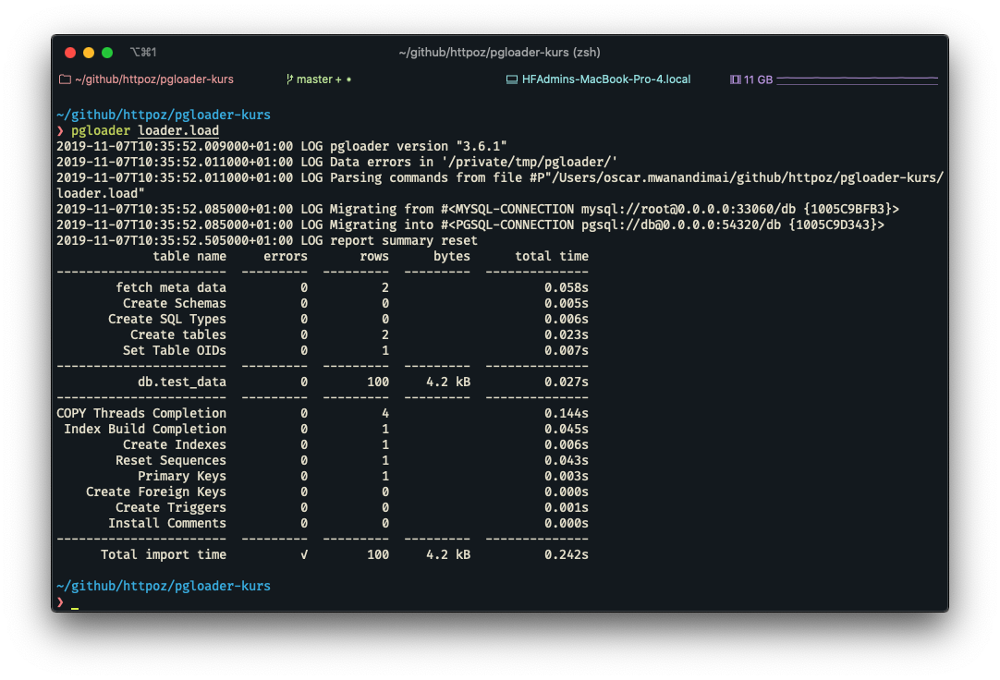

# pgloader example

## Resources
1. [pgloader documetation](https://pgloader.readthedocs.io/en/latest/index.html)
2. [Installing pgloader](https://github.com/dimitri/pgloader#installs)
3. 

## Instructions to run
1. `docker-compose up -d`
2. `pgloader loader.load`

## Result
